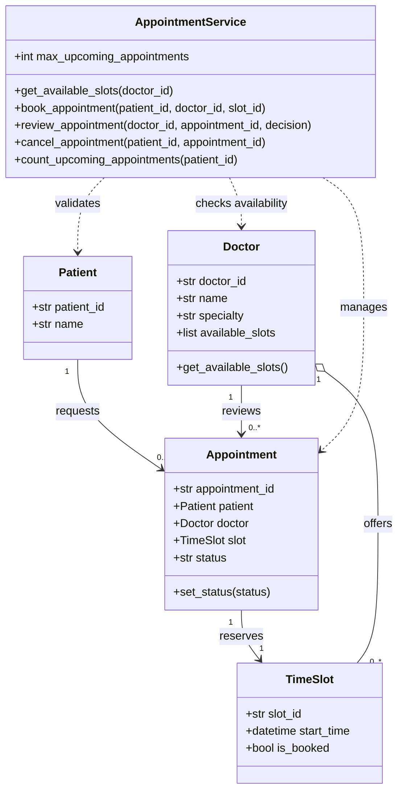

# P5 — Class Diagram

```mermaid
classDiagram
    class Patient {
      +str patient_id
      +str name
    }

    class Doctor {
      +str doctor_id
      +str name
      +str specialty
      +list available_slots
      +get_available_slots()
    }

    class TimeSlot {
      +str slot_id
      +datetime start_time
      +bool is_booked
    }

    class Appointment {
      +str appointment_id
      +Patient patient
      +Doctor doctor
      +TimeSlot slot
      +str status
      +set_status(status)
    }

    class AppointmentService {
      +int max_upcoming_appointments
      +get_available_slots(doctor_id)
      +book_appointment(patient_id, doctor_id, slot_id)
      +review_appointment(doctor_id, appointment_id, decision)
      +cancel_appointment(patient_id, appointment_id)
      +count_upcoming_appointments(patient_id)
    }

    Patient "1" --> "0..*" Appointment : requests
    Doctor "1" --> "0..*" Appointment : reviews
    Appointment "1" --> "1" TimeSlot : reserves
    Doctor "1" o-- "0..*" TimeSlot : offers
    AppointmentService ..> Patient : validates
    AppointmentService ..> Doctor : checks availability
    AppointmentService ..> Appointment : manages
```

**Design note:** A slot can be reserved by at most one appointment. The service counts only future `Pending` and `Accepted` appointments toward N = 3.
