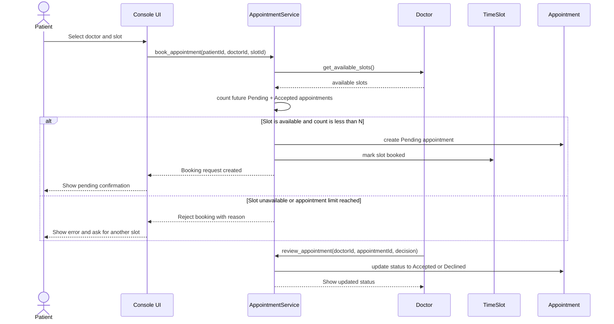

# P6 — Sequence Diagram: Request an Appointment

```mermaid
sequenceDiagram
    actor Patient
    participant UI as Console UI
    participant Service as AppointmentService
    participant Doctor
    participant Slot as TimeSlot
    participant Appointment

    Patient->>UI: Select doctor and slot
    UI->>Service: book_appointment(patientId, doctorId, slotId)
    Service->>Doctor: get_available_slots()
    Doctor-->>Service: available slots
    Service->>Service: count future Pending + Accepted appointments
    alt Slot is available and count is less than N
        Service->>Appointment: create Pending appointment
        Service->>Slot: mark slot booked
        Service-->>UI: Booking request created
        UI-->>Patient: Show pending confirmation
    else Slot unavailable or appointment limit reached
        Service-->>UI: Reject booking with reason
        UI-->>Patient: Show error and ask for another slot
    end

    Doctor->>Service: review_appointment(doctorId, appointmentId, decision)
    Service->>Appointment: update status to Accepted or Declined
    Service-->>Doctor: Show updated status
```
