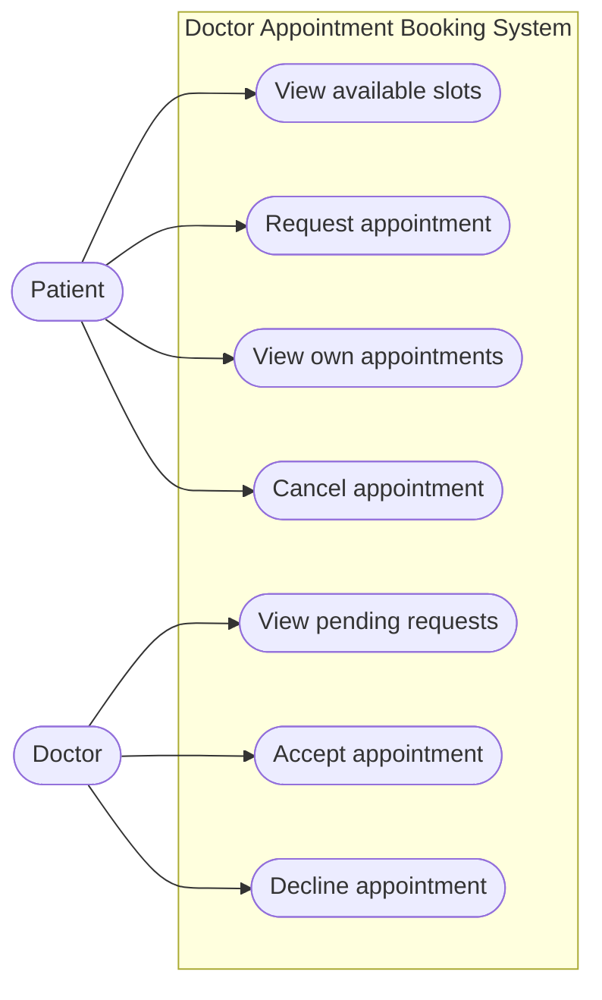

# P3 — Use Case Diagram

```mermaid
flowchart LR
    Patient([Patient])
    Doctor([Doctor])

    subgraph System[Doctor Appointment Booking System]
      UC1([View available slots])
      UC2([Request appointment])
      UC3([View own appointments])
      UC4([Cancel appointment])
      UC5([View pending requests])
      UC6([Accept appointment])
      UC7([Decline appointment])
    end

    Patient --> UC1
    Patient --> UC2
    Patient --> UC3
    Patient --> UC4
    Doctor --> UC5
    Doctor --> UC6
    Doctor --> UC7
```
